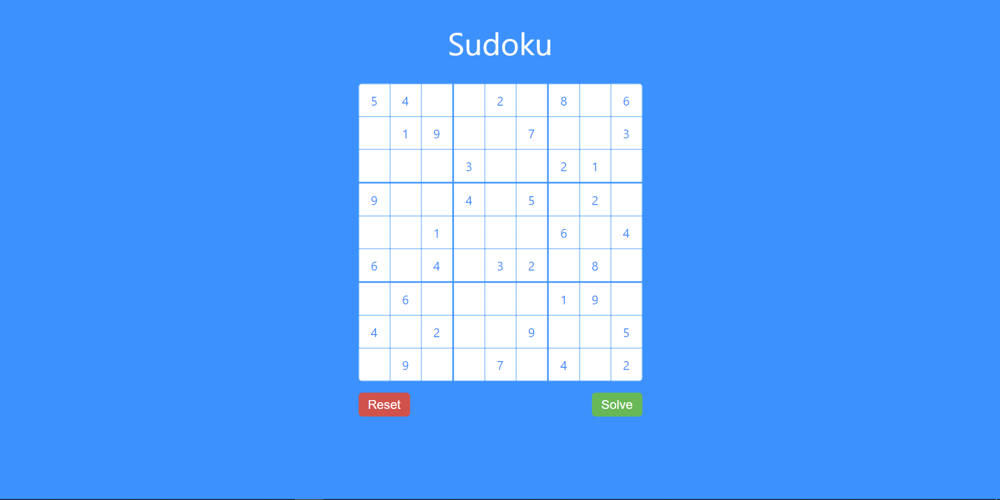

# Sudoku Solver - AI Course Project


<!-- --- -->

## Team Members
- Mohamed Mousa
- Hazem Essam Saleh - Sec 3

<!-- --- -->

## Requirements
- Python 3
- Flask

<!-- --- -->

## Installation & Setup
1. Clone the repo and access it:
    ```bash
    $ git clone https://github.com/hazemessam/sudoku
    $ cd sudoku
    ```
2. Create virtual environment and enable it:
    ```bash
    $ python3 -m venv venv
    $ source venv/bin/activate
    ```
3. Install requirements:
    ```bash
    $ pip3 install -r requirements.txt
    ```
4. Run the server:
    ```bash
    $ python3 server.py
    ```
5. Check http://localhost:5000
